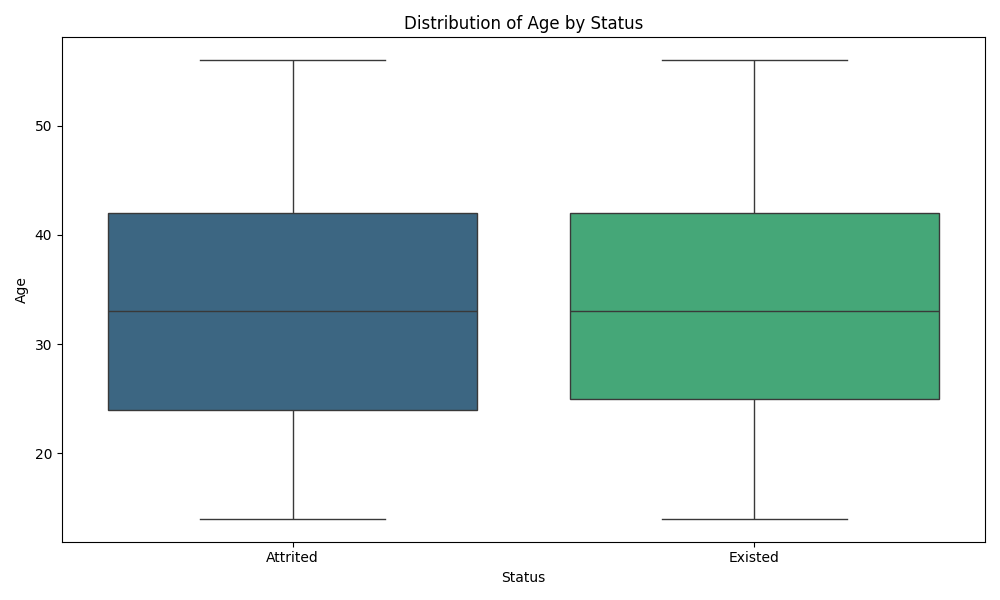
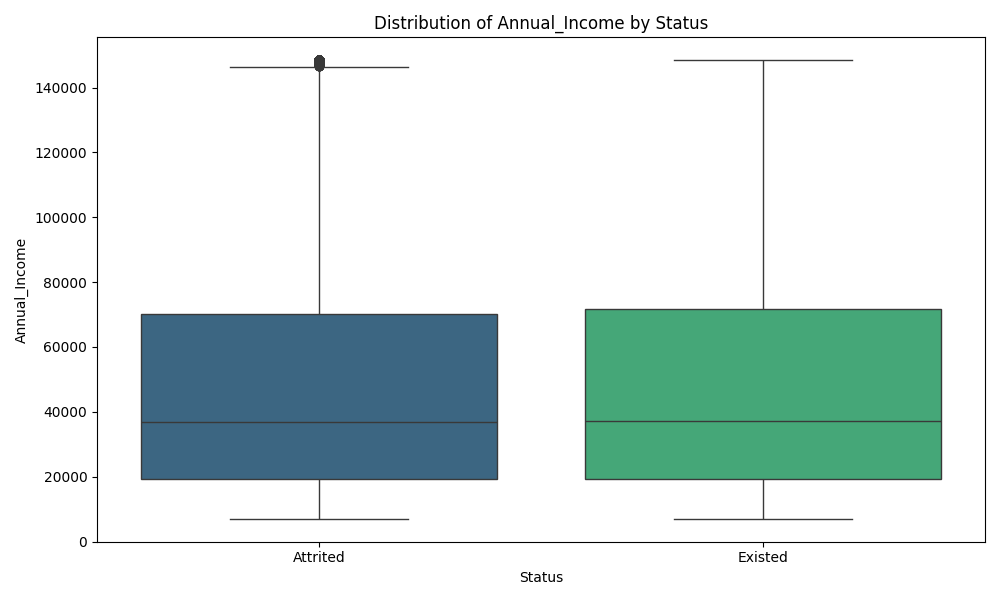
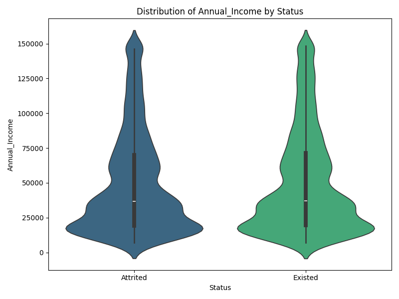
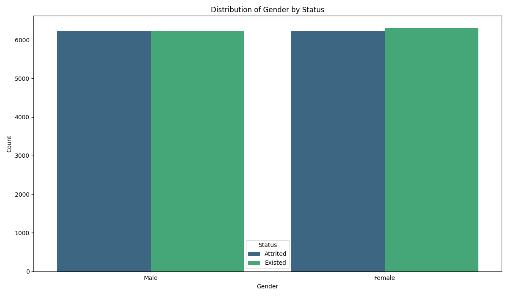
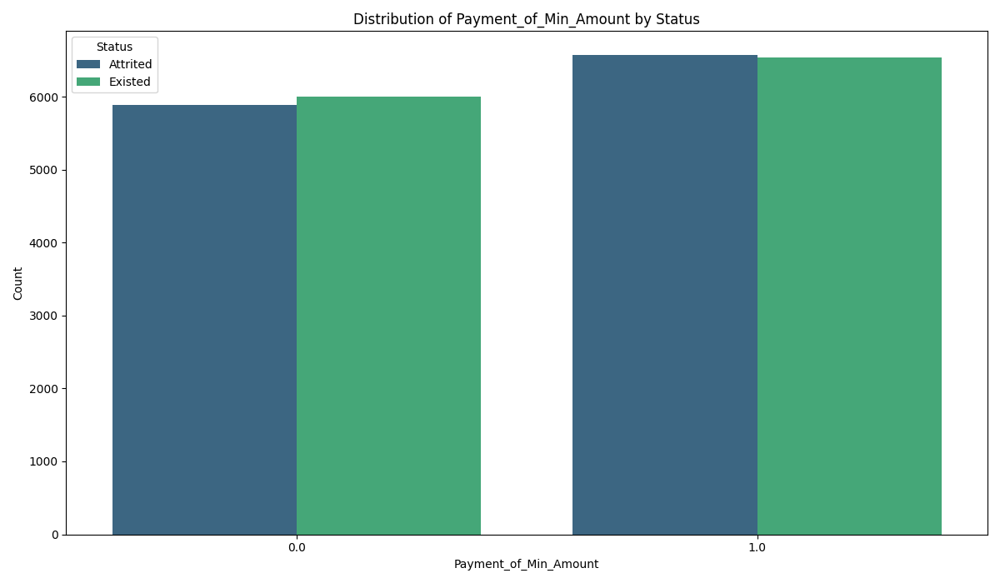
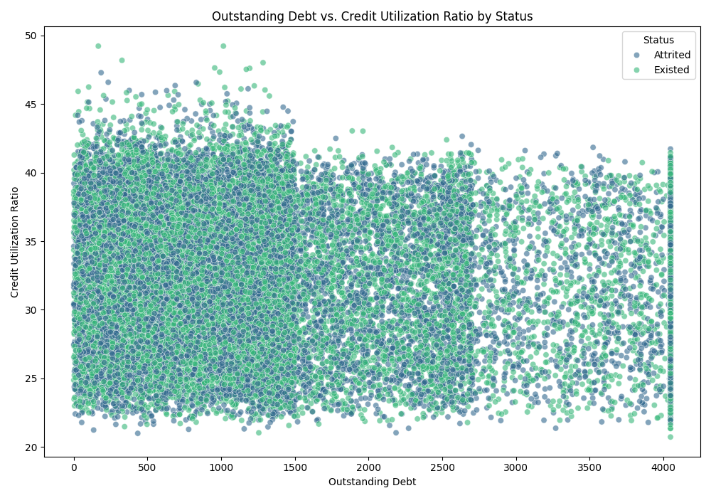
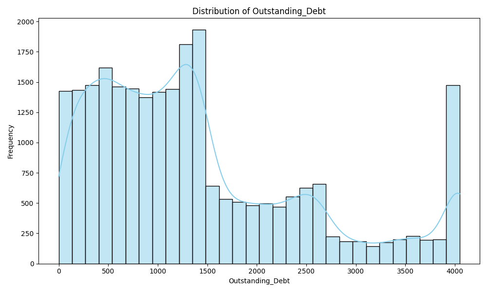
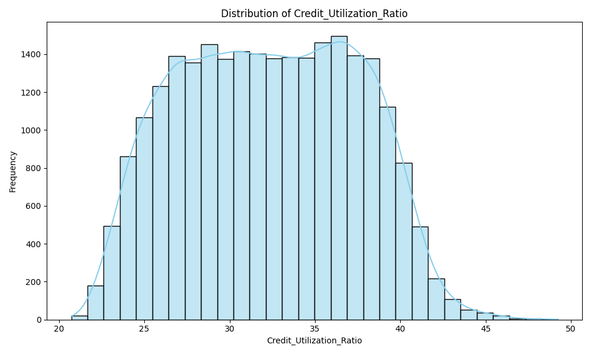
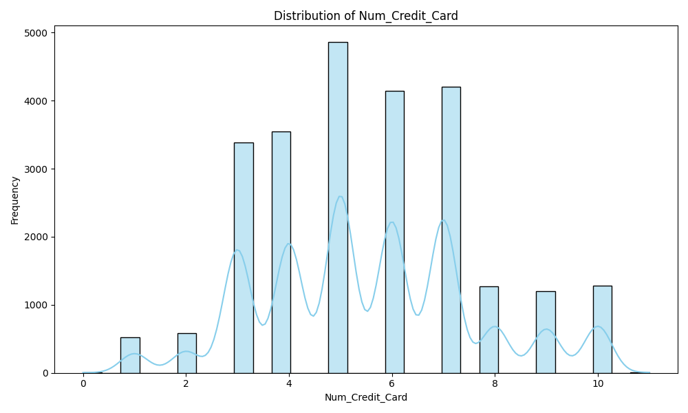
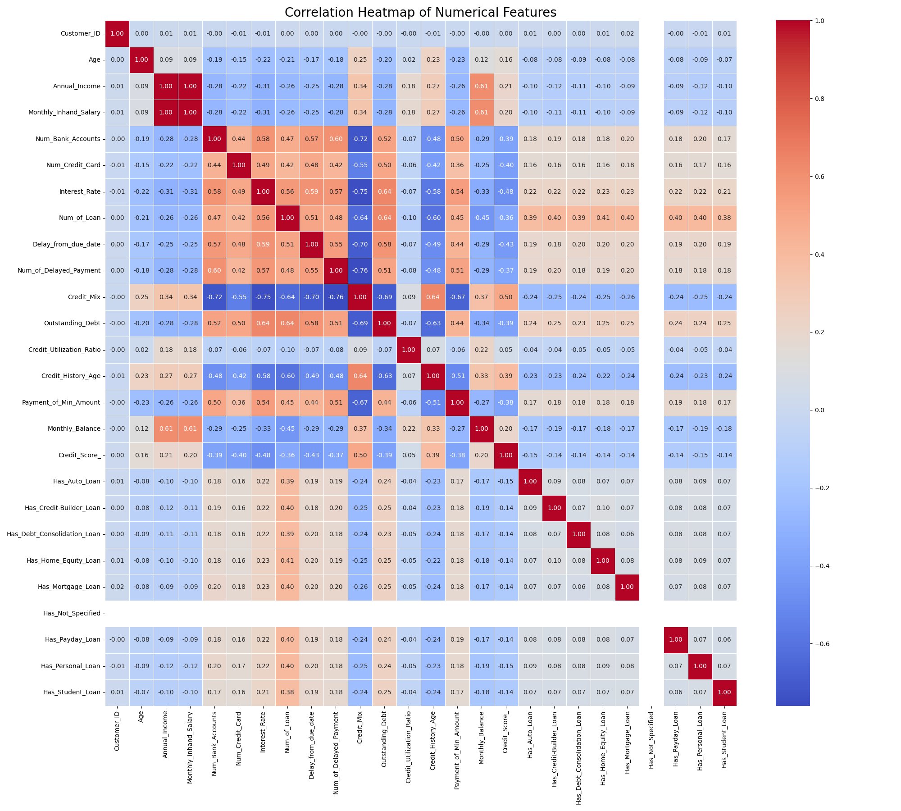

# 💳 CardPulse — Credit Card Customer Churn Analysis

    

> Predicting and analyzing credit card customer churn across 25,000 customers using a full analytics pipeline — from SQL attrition analysis to machine learning classification and Tableau dashboards.

---

## 📌 Problem Statement

Credit card companies face a critical challenge: identifying customers likely to churn before they leave. This project analyzes **25,000 credit card customer records** to uncover behavioral and financial signals that drive attrition, and builds a classification model to predict churn risk.

---

## 🗂️ Project Structure

| File | Description |
|---|---|
| `EDA.ipynb` | Data cleaning, outlier handling (IQR), SMOTE balancing, feature engineering, 20+ visualizations |
| `Credit_Card_Customers_Segmentation.ipynb` | Customer segmentation and credit score analysis |
| `Bank_Credit_Card_Churn_Prediction.ipynb` | 13 ML models trained, evaluated, and compared |
| `Credit_Card_SQL_Analysis.txt` | 6 SQL queries for attrition analysis across geographies |
| `Tableau_Workbook.twbx` | Interactive Tableau dashboard *(coming soon)* |
| `CreditCard.csv` | Raw dataset (25,000 rows, 24 features) |
| `CreditCard_cleaned_balanced.csv` | Cleaned and SMOTE-balanced dataset for ML training |

---

## ⚙️ Pipeline

```
Raw CSV → Data Cleaning → Feature Engineering → EDA → SQL Analysis → ML Modeling → Tableau Dashboard
```

**1. Data Cleaning** — Corrected typos (Geramany → Germany), standardized `Payment_of_Min_Amount` (NM → No), dropped redundant `Credit_Score` column, capped outliers using IQR method

**2. Feature Engineering** — Transformed `Type_of_Loan` into 12 binary columns (Has_Auto_Loan, Has_Personal_Loan etc.), created `Debt_to_Income_Ratio`, `Credit_History_Years`

**3. Class Imbalance** — Applied **SMOTEENN** (SMOTE + Edited Nearest Neighbours) to balance attrited vs existing customer classes for model training

**4. EDA** — 20+ visualizations revealing churn patterns across geography, occupation, credit score, payment behaviour, and income

**5. SQL** — 6 attrition queries including age-range bucketing, gender breakdown, payment status analysis

**6. ML** — 13 classification models trained and compared on balanced dataset

**7. Tableau** — Interactive dashboard with churn KPIs, geographic breakdown, and financial risk profiling

---

## 📊 Exploratory Data Analysis

### Age Distribution by Status


### Annual Income by Status (Box Plot)


### Annual Income by Status (Violin)


### Gender Distribution by Status


### Payment of Min Amount by Status


### Outstanding Debt vs Credit Utilization Ratio


### Distribution of Outstanding Debt


### Distribution of Credit Utilization Ratio


### Distribution of Number of Credit Cards


### Correlation Heatmap


---

## 🤖 Machine Learning Results

**Target Variable:** `Status` (Attrited = 1, Existed = 0) — Binary Classification

**Features:** Age, Annual Income, Credit Score, Credit Utilization Ratio, Outstanding Debt, Delay from Due Date, Num of Loans, Payment of Min Amount, Geography, Occupation, Gender, 12 Loan type binary flags

> Before SMOTE all models were stuck at ~50% accuracy due to class imbalance. After SMOTEENN, performance improved significantly.

| Model | Before SMOTE | After SMOTE |
|---|---|---|
| **Bagging Classifier** | 48.78% | **85.19% ✅** |
| Random Forest | 48.62% | **83.53%** |
| XGBoost | 48.92% | 79.03% |
| Extra Trees | 49.64% | 78.54% |
| KNN | 49.04% | 77.20% |
| Gradient Boosting | 50.02% | 65.39% |
| AdaBoost | 48.58% | 58.90% |
| Multinomial Naive Bayes | 50.28% | 54.08% |
| Decision Tree | 48.42% | 53.41% |
| Logistic Regression | 50.10% | 51.08% |
| SVM | 50.16% | 49.92% |
| Gaussian Naive Bayes | 50.50% | 49.25% |
| Bernoulli Naive Bayes | 49.86% | 49.25% |

✅ **Best Model: Bagging Classifier — 85.19% accuracy after SMOTEENN**

---

## 🛢️ SQL Analysis

6 queries written against the raw dataset:

- **Overview** — First 10 entries for data inspection
- **Geographic distribution** — Customer count by country
- **Occupation breakdown** — Top 5 occupations among existing customers
- **Age-range bucketing** — Attrited customers split into 0-20, 20-40, 40-60, 60+ bands
- **Gender split** — Male vs Female across Attrited and Existed
- **Payment status** — Attrited customers by min payment compliance

---

## 📈 Tableau Dashboard *(coming soon)*

Three interactive dashboard views:

**Dashboard 1 — Churn Overview** — Churn rate KPI by geography, gender and occupation breakdown, credit score by status

**Dashboard 2 — Financial Risk Profile** — Debt-to-Income ratio by churn, credit utilization vs monthly balance, outstanding debt vs churn rate

**Dashboard 3 — Behavioral Signals** — Delayed payments vs churn, loan type vs attrition, credit history length vs churn risk

---

## 🔍 Key Insights

- 💳 Interest rates **above 15%** correlate with significantly worse credit scores
- 🏦 Holding **more than 5 bank accounts** negatively impacts credit scores
- ⏰ Delaying payments **more than 17 days** hurts credit scores
- 💰 Outstanding debt **above $1,338** correlates with poor credit scores
- 📅 Longer credit history consistently leads to better credit scores
- 🔁 Taking **more than 3 loans simultaneously** negatively impacts credit scores
- 👫 Gender shows **no significant difference** in churn rate
- 📈 SMOTEENN improved best model accuracy from **~50% to 85.19%**

---

## 🧰 Tech Stack

| Tool | Purpose |
|---|---|
| Python (Pandas, NumPy) | Data cleaning & feature engineering |
| Matplotlib, Seaborn | EDA visualizations |
| Scikit-learn | 13 ML models, evaluation |
| imbalanced-learn (SMOTEENN) | Class imbalance handling |
| MySQL | SQL attrition analysis |
| Tableau Public | Interactive dashboards |

---

## 📁 Dataset

- **25,000** credit card customer records | **24** original features
- Geographies: India, France, Spain, Germany
- Target: `Status` (Attrited / Existed)
